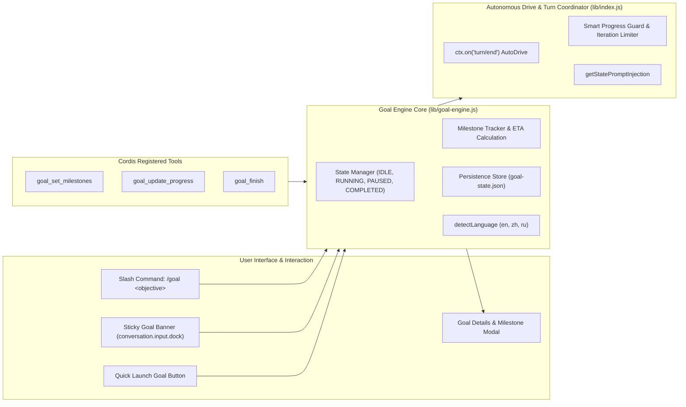

# 📦 @goodandready/dsh-goal

<div align="center">

<h3>Autonomous Goal Execution & Multi-Turn Task Tracking Engine with Sticky Header for DeepSeek Harness</h3>

<p align="center">
  <a href="https://www.npmjs.com/package/@goodandready/dsh-goal"></a>
  <a href="LICENSE"></a>
  <a href="https://github.com/topics/dsh-plugin"></a>
  <a href="https://nodejs.org"></a>
</p>

<!-- Обязательная кнопка перехода на витрину всех проектов -->
<p align="center">
  <a href="https://goodandready.app/"></a>
</p>

<p align="center">
  <a href="README.md"><b>🇬🇧 English</b></a> •
  <a href="README.ru.md"><b>🇷🇺 Русский</b></a> •
  <a href="README.zh.md"><b>🇨🇳 中文说明</b></a>
</p>

<!-- Обязательный блок поддержки проекта: локализуй текст под язык README -->
<table align="center">
  <tr>
    <td align="center">
      ⭐ <strong>If you like this plugin, please star it on GitHub</strong> — it shows me that the plugin is useful to you and motivates me to keep developing it.
      <br><br>
      🐛 <strong>If you find a bug or would like to request a feature</strong>, open a GitHub issue in any language — I will review your proposal and implement useful suggestions in a future plugin version.
    </td>
  </tr>
</table>

</div>

---

## ⚡ Overview & The Problem

Complex engineering tasks require multi-step autonomy: decomposing high-level objectives into sequential milestones, executing iterations without requiring manual user re-prompting, and maintaining clear visibility into task progress.

Without an autonomous tracking framework, agents can lose context across turns, stall in passive loops, or fail to notify users when complex workflows stall.

**`@goodandready/dsh-goal`** introduces Goal Mode to DeepSeek Harness:
* 💡 **Live Steering & Nudge (*Added in v0.2.0*)**: Dynamically clarify, amend, or guide the agent's active objective on the fly without aborting the loop.
* 🔔 **Native Browser Notifications (*Added in v0.2.0*)**: Zero-dependency desktop push notifications via HTML5 `Notification API` when long-running goals complete or require attention.
* 📑 **10 Quick Launch Presets (*Added in v0.2.0*)**: Ready-to-use engineering prompt chips (Fix Bug, Refactor YAGNI, Tests & Coverage, Code Review, Security Audit, New Feature, Docs, Upgrade Deps, Dead Code Cleanup, Performance).
* 🛡️ **Tool-Failure Breaker (*Added in v0.2.0*)**: Configurable consecutive tool error limit (`consecutiveToolFailureLimit`, default: 3) to halt loops upon repetitive tool crashes and prevent token burn.
* 📌 **Git Checkpoint Snapshot (*Added in v0.2.0*)**: Automatically captures start commit hash (`git rev-parse --short HEAD`) with 1-click `git diff` / rollback command in details modal.
* 🐙 **GitHub & Gitea PR Comment Export (*Added in v0.2.0*)**: One-click formatted comment generator with collapsible `<details><summary>` milestone cards and token telemetry.
* 🎯 **Sticky Top Goal Banner**: Pinned header over composer dock with live elapsed timer (`• 2s`, `• 1m 45s`), real-time status badge (`RUNNING`, `PAUSED`, `COMPLETED`), active goal title, and control actions.
* ⏸️ **Play / Pause / Resume / Cancel**: Instantly pause the autonomous loop or resume execution on demand via buttons or `/goal` command.
* 📋 **Milestone Breakdown & ETA**: Interactive checklist showing sub-tasks, completion status (`pending`, `in_progress`, `completed`, `failed`), progress bar, and dynamic completion ETA.
* 🌐 **Multi-Language Auto-Detection (*Added in v0.1.9*)**: Prompt injection, autonomous follow-ups, and UI badges automatically follow the user's input language (English by default, Chinese, or Russian when entered in Cyrillic).
* 🔘 **Quick Launch Button (*Added in v0.1.8*)**: Fast goal launcher docked above the message input with instant objective prompt modal. Toggleable in settings.
* 📊 **Token Usage Tracking & Markdown Export (*Added in v0.1.7*)**: Accumulated prompt, completion, and total tokens tracked per session with one-click Markdown summary export.
* 🤖 **Autonomous Agent Contract**: Provides `goal_set_milestones`, `goal_update_progress`, and `goal_finish` tools directly to the agent.
* 🔄 **Core DSH Goal Tools Interception (*Added in v0.1.10*)**: Seamless drop-in compatibility for models calling built-in DSH goal tools (`update_goal`, `get_goal`, `create_goal`). Intercepts actions (`complete`, `pause`, `resume`, `edit`, `blocked`), bypasses rigid authority restrictions that caused crashes (`complete and blocked require a direct human turn`), and routes all state updates directly to GoalEngine.
* 🛡️ **Safety Guardrails**: Configurable `maxIterations` safety limit and Smart Progress Guard to catch and pause idle turns without progress.
* 🔔 **Web Audio Chimes**: Pleasant synthesized audio feedback on goal completion or failure via Web Audio API.

---

## 🏛️ Architecture



---

## ✨ Features & Module Breakdown

### 1. `lib/goal-engine.js` — State Engine
Zero external dependency core managing session goals, milestone states, elapsed time calculations, ETA forecasts, token accumulators, and crash recovery hydration.
* **Auto Language Detection**: Automatically analyzes goal title and parameters (`detectLanguage`) to select English (`en`), Chinese (`zh`), or Russian (`ru`).
* **ETA Estimator**: Predicts remaining time based on average milestone velocity:
  $$\text{ETA} = \frac{\text{elapsed}}{\text{completedMilestones}} \times \text{remainingMilestones}$$
* **Low-Latency State Serialization**: Synchronous debounced atomic file persistence to prevent data loss on crashes.

### 2. `lib/command-handler.js` — Slash Commands
Handles `/goal` commands and subcommands:
* `/goal <objective>`: Starts a new autonomous goal.
* `/goal pause`: Pauses current goal and halts agent turn.
* `/goal resume`: Resumes execution and triggers agent continuation.
* `/goal clear`: Resets session goal to IDLE.
* `/goal`: Shows status, elapsed time, ETA, iterations, tokens, and active milestones.

### 3. `lib/index.js` — DSH Cordis Lifecycle Coordinator
* Registers REST API endpoints (`GET /dsh-goal/state`, `POST /dsh-goal/action`, `GET /dsh-goal/events` SSE stream).
* Subscribes to `turn/end` for zero-latency turn-to-turn auto-drive using `setImmediate`.
* Listens to `approval/asked` to automatically pause goal when operator confirmation is needed.
* Registers agent tools: `goal_set_milestones`, `goal_update_progress`, `goal_finish`.
* Seamlessly shadows core DSH goal tools: `update_goal`, `get_goal`, `create_goal` with zero collision and full `GOAL_OUTPUT` schema compliance.

### 4. `lib/client.js` — Frontend Web UI
* **Sticky Top Banner**: Mounts via slot `conversation.input.dock` with live timer, status badge, pause/resume, and details button.
* **Goal Details Modal**: Full milestone list, progress bar, token statistics, and 📋 Markdown Report Copy.
* **Quick Launch Button**: Floating launcher for rapid goal formulation without typing slash commands.
* **Plugin Settings Card**: Schemastery-backed settings UI registered via `settings.plugin.item`.

---

## 📦 Installation

```bash
dsh plugin --profile web add @goodandready/dsh-goal
```

Restart your DeepSeek Harness instance and refresh the browser.

---

## 💬 Usage & Quick Start

### 1. Start a Goal via Chat
Simply enter the `/goal` slash command:

```text
/goal Refactor authentication middleware and cover with unit tests
```

The agent will immediately:
1. Establish a structured milestone plan via `goal_set_milestones`.
2. Advance through milestones, marking each `in_progress` and `completed` via `goal_update_progress`.
3. Conclude with a full summary via `goal_finish`.

### 2. Quick Launch Button
Click the **Start Goal** button directly above the message input box, type your objective, and click **Start Goal**.

### 3. REST API Control
Control goals programmatically via HTTP:

```bash
# Start a goal
curl -X POST http://localhost:3080/dsh-goal/action \
  -H "Content-Type: application/json" \
  -d '{"action":"start","title":"Implement automated backup pipeline"}'

# Pause
curl -X POST http://localhost:3080/dsh-goal/action \
  -H "Content-Type: application/json" \
  -d '{"action":"pause"}'

# Resume
curl -X POST http://localhost:3080/dsh-goal/action \
  -H "Content-Type: application/json" \
  -d '{"action":"resume"}'

# Inspect live state
curl http://localhost:3080/dsh-goal/state
```

---

## ⚙️ Configuration Reference (`settings.yaml`)

Configure settings in `settings.yaml` or through the **Settings → Plugins → Goal Mode** UI card:

```yaml
dsh-goal:
  maxIterations: 25
  autoDrive: true
  enableSound: true
  showQuickLaunchButton: true
  consecutiveToolFailureLimit: 3
  enableBrowserNotifications: true
```

| Parameter | Type | Default | Description |
|:---|:---|:---|:---|
| `maxIterations` | `number` | `25` | Safety limit: maximum autonomous turns per goal |
| `autoDrive` | `boolean` | `true` | Keep the autonomous agent loop running between turns |
| `enableSound` | `boolean` | `true` | Play audio chime when a goal completes or fails |
| `showQuickLaunchButton` | `boolean` | `true` | Show the quick launch goal button above the composer dock |
| `consecutiveToolFailureLimit` | `number` | `3` | Auto-pause goal if N consecutive turns hit tool execution errors (0 to disable) |
| `enableBrowserNotifications` | `boolean` | `true` | Show native desktop push notifications on goal completion or failure |

---

## 🧪 Testing

Run unit and integration tests:

```bash
npm test
```

---

## 📄 License

MIT © [GooDAnDReaDY](https://github.com/GooDAnDReaDY)
