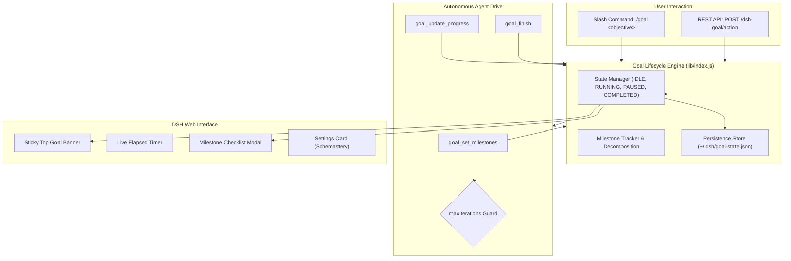

# 📦 @goodandready/dsh-goal

<div align="center">

<h3>Autonomous Goal Execution & Multi-Turn Task Tracking Engine with Sticky Header for DeepSeek Harness</h3>

<p align="center">
  <a href="https://www.npmjs.com/package/@goodandready/dsh-goal"></a>
  <a href="LICENSE"></a>
  <a href="https://github.com/topics/dsh-plugin"></a>
  <a href="https://nodejs.org"></a>
</p>

<!-- Author Showcase Link -->
<p align="center">
  <a href="https://goodandready.app/"></a>
</p>

<p align="center">
  <a href="README.md"><b>🇬🇧 English</b></a> •
  <a href="docs/README.ru.md"><b>🇷🇺 Русский</b></a> •
  <a href="docs/README.zh.md"><b>🇨🇳 中文说明</b></a>
</p>

</div>

---

## ⚡ Overview & The Problem

Complex engineering tasks require multi-step autonomy: decomposing high-level objectives into milestones, executing successive iterations without manual user re-prompting, and maintaining clear visibility into task progress.

**`@goodandready/dsh-goal`** brings autonomous goal execution to DeepSeek Harness via the `/goal` command:
* 🎯 **Sticky Top Goal Banner**: Pinned status header with live timer (`• 2s`, `• 1m 45s`), active goal title, and interactive control buttons.
* ⏸️ **Play / Pause / Cancel**: Instantly pause the autonomous loop or resume execution on demand.
* 📋 **Milestone Breakdown Drawer**: Interactive checklist showing sub-tasks, percentage completion, and iteration logs.
* 🤖 **Autonomous Agent Tools**: Provides `goal_set_milestones`, `goal_update_progress`, and `goal_finish` tools directly to the agent.
* 🛡️ **Safety Guardrails**: Configurable `maxIterations` limit to prevent runaway loops.

---

## 🏛️ Architecture



---

## 📦 Installation

```bash
dsh plugin --profile web add @goodandready/dsh-goal
```

Restart your DeepSeek Harness instance and refresh the browser.

---

## 💬 Usage & Quick Start

Start a goal directly in chat:

```text
/goal Refactor the authentication middleware and add integration tests
```

Or trigger via REST API:

```bash
curl -X POST http://localhost:3080/dsh-goal/action \
  -H "Content-Type: application/json" \
  -d '{"action":"start","title":"Optimize database queries"}'
```

---

## ⚙️ Configuration Reference (`settings.yaml`)

```yaml
dsh-goal:
  maxIterations: 25
  autoDrive: true
  enableSound: true
```

| Parameter | Type | Default | Description |
|:---|:---|:---|:---|
| `maxIterations` | `number` | `25` | Safety limit: maximum autonomous iterations per goal |
| `autoDrive` | `boolean` | `true` | Keep the autonomous agent loop running between turns |
| `enableSound` | `boolean` | `true` | Play completion audio chime when a goal finishes |

---

## 🧪 Testing

Run the automated test suite:

```bash
npm test
```

---

## 📄 License

MIT © [GooDAnDReaDY](https://github.com/GooDAnDReaDY)
