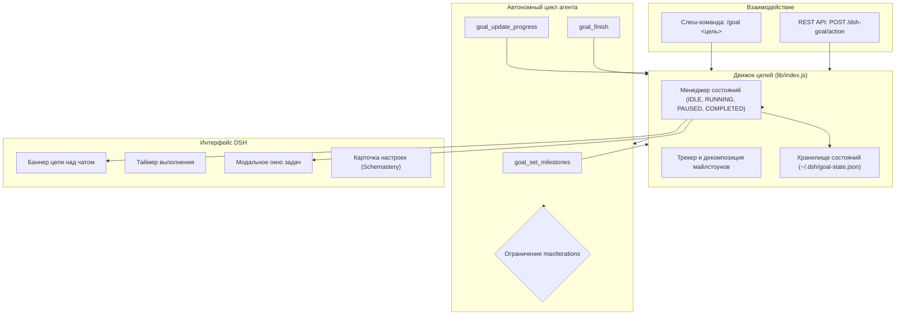

# 📦 @goodandready/dsh-goal

<div align="center">

<h3>Движок автономного выполнения целей и многошагового трекинга задач для DeepSeek Harness</h3>

<p align="center">
  <a href="https://www.npmjs.com/package/@goodandready/dsh-goal"></a>
  <a href="../LICENSE"></a>
  <a href="https://github.com/topics/dsh-plugin"></a>
  <a href="https://nodejs.org"></a>
</p>

<!-- Обязательная кнопка перехода на витрину всех проектов -->
<p align="center">
  <a href="https://goodandready.app/"></a>
</p>

<p align="center">
  <a href="README.md"><b>🇬🇧 English</b></a> •
  <a href="README.ru.md"><b>🇷🇺 Русский</b></a> •
  <a href="README.zh.md"><b>🇨🇳 中文说明</b></a>
</p>

<table align="center">
  <tr>
    <td align="center">
      ⭐ <strong>Если вам нравится этот плагин, поставьте ему звезду на GitHub</strong> — это покажет мне, что плагин вам полезен, и будет мотивировать меня развивать его дальше.
      <br><br>
      🐛 <strong>Если вы нашли баг или хотите предложить новый функционал</strong>, создайте issue на GitHub на любом языке — я рассмотрю ваше предложение и реализую полезные идеи в одной из следующих версий плагина.
    </td>
  </tr>
</table>

</div>

---

## ⚡ Обзор и решаемая проблема

Решение комплексных инженерных задач требует автономного многошагового выполнения: декомпозиции целей на майлстоуны, непрерывного выполнения итераций без ручного подталкивания пользователя и наглядного отслеживания прогресса.

**`@goodandready/dsh-goal`** внедряет автономный режим достижения целей в DeepSeek Harness через команду `/goal`:
* 💡 **Живая корректировка цели / Направление агента (*v0.2.0*)**: Возможность вносить точечные правки и уточнения в активную цель на лету без прерывания сессии.
* 🔔 **Браузерные уведомления (*v0.2.0*)**: Нативные пуш-уведомления через HTML5 `Notification API` по завершении или сбое цели.
* 📑 **10 инженерных пресетов (*v0.2.0*)**: Готовые кликабельные шаблоны задач (Fix Bug, Refactor YAGNI, Tests, Code Review, Security, Docs, Upgrade Deps, Cleanup, Performance) в окне запуска.
* 🛡️ **Tool-Failure Breaker (*v0.2.0*)**: Настраиваемый порог ошибок инструментов (`consecutiveToolFailureLimit`, по умолчанию 3) для предотвращения бесконечных сбойных вызовов.
* 📌 **Git Checkpoint (*v0.2.0*)**: Фиксация коммита старта (`git rev-parse --short HEAD`) и копирование команды `git diff` в 1 клик.
* 🐙 **Экспорт отчета для GitHub / Gitea PR (*v0.2.0*)**: Генерация отчета со сворачиваемыми спойлерами `<details><summary>` для PR и задач.
* 🎯 **Плавающий баннер в шапке**: зафиксированный статус-бар над чатом с таймером выполнения (`• 2s`, `• 1m 45s`), заголовком цели и кнопками управления.
* ⏸️ **Управление циклом (Play / Pause / Cancel)**: мгновенная приостановка автономного цикла агента или его возобновление в любой момент.
* 📋 **Интерактивная панель майлстоунов**: модальное окно со списком подзадач, прогресс-баром и журналом выполнения.
* 🤖 **Инструменты агента**: `goal_set_milestones`, `goal_update_progress` и `goal_finish` для самостоятельной работы ИИ.
* 🔄 **Перехват и замещение инструментов ядра DSH (*Добавлено в v0.1.10*)**: Бесшовная совместимость для моделей, вызывающих стандартные инструменты DSH (`update_goal`, `get_goal`, `create_goal`). Перехватывает действия (`complete`, `pause`, `resume`, `edit`, `blocked`), устраняет падения ядра (`complete and blocked require a direct human turn`) и синхронизирует состояние напрямую с GoalEngine.
* 🛡️ **Защитные лимиты**: настраиваемое ограничение `maxIterations` для предотвращения бесконечных циклов.

---

## 🏛️ Архитектура



---

## 📦 Установка

```bash
dsh plugin --profile web add @goodandready/dsh-goal
```

Перезапустите экземпляр DeepSeek Harness и обновите вкладку в браузере.

---

## 💬 Быстрый старт

Запустите цель прямо в чате:

```text
/goal Провести рефакторинг middleware авторизации и написать интеграционные тесты
```

Или через REST API:

```bash
curl -X POST http://localhost:3080/dsh-goal/action \
  -H "Content-Type: application/json" \
  -d '{"action":"start","title":"Оптимизация SQL-запросов"}'
```

---

## ⚙️ Таблица конфигурации (`settings.yaml`)

```yaml
dsh-goal:
  maxIterations: 25
  autoDrive: true
  enableSound: true
```

| Параметр | Тип | По умолчанию | Описание |
|:---|:---|:---|:---|
| `maxIterations` | `number` | `25` | Защитный лимит: максимум автономных итераций на цель |
| `autoDrive` | `boolean` | `true` | Автоматически продолжать автономный цикл между тактами |
| `enableSound` | `boolean` | `true` | Звуковое уведомление при успешном завершении цели |

---

## 🧪 Тестирование

Запуск набора юнит-тестов:

```bash
npm test
```

---

---

## 📦 История версий (Release Notes)

### v0.2.3
- **Автообновление**: Встроен эндпоинт API автообновления в один клик по адресу `/api/dsh-goal/update` с fail-closed проверкой источника.
- **Модульная архитектура**: Серверная половина плагина полностью декомпозирована на специализированные модули (<600 строк каждый): маршруты, инструменты, хранилище, отчёты и модуль обновления.
- **Чистое разделение локализации**: Из `lib/*.js` удалены все зашитые русские строки и ветвления; ядро поддерживает только `en` и `zh`, а русская локализация поставляется плагином `@goodandready/dsh-russian-lang`.
- **Надёжность**: Устранены все пустые блоки `catch`, добавлено контекстное логирование завершения целей и автоматическая очистка отключившихся SSE-клиентов.
- **Дизайн-система**: Чужеродные CSS-классы и явные цвета RGBA заменены на стандартные токены дизайн-системы DSH (`--dsw-alias-*`).
- **Защита карточки настроек**: Исправлена обработка снимка настроек при загрузке или отсутствии сервиса, исключающая ложный статус `ready`.

## 📄 Лицензия

MIT © [GooDAnDReaDY](https://github.com/GooDAnDReaDY)
