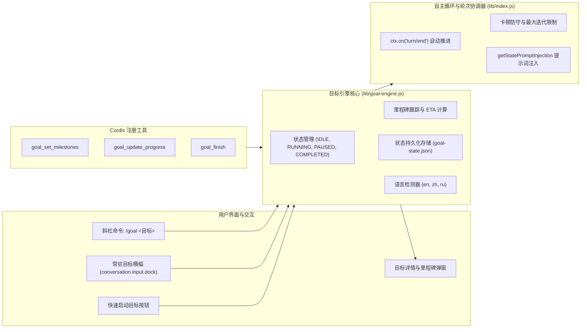

# 📦 @goodandready/dsh-goal

<div align="center">

<h3>DeepSeek Harness 自主目标执行与多轮任务跟踪引擎</h3>

<p align="center">
  <a href="https://www.npmjs.com/package/@goodandready/dsh-goal"></a>
  <a href="LICENSE"></a>
  <a href="https://github.com/topics/dsh-plugin"></a>
  <a href="https://nodejs.org"></a>
</p>

<!-- Обязательная кнопка перехода на витрину всех проектов -->
<p align="center">
  <a href="https://goodandready.app/"></a>
</p>

<p align="center">
  <a href="README.md"><b>🇬🇧 English</b></a> •
  <a href="README.zh.md"><b>🇨🇳 中文说明</b></a>
</p>

<!-- Обязательный блок поддержки проекта: локализуй текст под язык README -->
<table align="center">
  <tr>
    <td align="center">
      ⭐ <strong>如果您喜欢这个插件，请在 GitHub 上为它点亮 Star</strong> — 这能让我知道插件对您有用，并鼓励我继续开发和维护它。
      <br><br>
      🐛 <strong>如果您发现 Bug 或希望增加功能</strong>，请使用任意语言在 GitHub 上提交 Issue — 我会评估您的建议，并在后续版本中实现有价值的改进。
    </td>
  </tr>
</table>

</div>

---

## ⚡ 概述与解决的问题

复杂的工程开发任务需要多步骤的自主推进：将高层目标分解为有序的里程碑、在各轮交互间无需用户重复提示即可持续执行，并保持清晰直观的进度可视化。

如果缺乏目标跟踪框架，智能体容易在多轮对话中丢失上下文、陷入被动等待，或在遇到卡点时无法及时提醒用户。

**`@goodandready/dsh-goal`** 为 DeepSeek Harness 带来了完整的目标模式（Goal Mode）：
* 🎯 **输入框上方常驻目标横幅**：顶部常驻状态条，配备实时计时器（`• 2s`、`• 1m 45s`）、状态徽章（`RUNNING`、`PAUSED`、`COMPLETED`）、当前目标名称与控制操作。
* ⏸️ **播放 / 暂停 / 恢复 / 取消**：可通过按钮或 `/goal` 命令随时暂停自主循环，或在需要时恢复执行。
* 📋 **里程碑拆解与 ETA 预测**：交互式清单抽屉，展示子任务状态（`pending`、`in_progress`、`completed`、`failed`）、进度百分比与动态预估剩余时间。
* 🌐 **多语言智能识别（v0.1.9 新增）**：提示词注入、自主轮次追问和 UI 状态徽章自动匹配用户输入语言（默认英语，支持中文和俄语）。
* 🔘 **快速启动按钮（v0.1.8 新增）**：常驻于输入框上方的启动按钮，支持弹窗一键制定目标，可在设置中自由开关。
* 📊 **Token 消耗统计与 Markdown 导出（v0.1.7 新增）**：实时累计提示词、生成词及总 Token 消耗，支持一键复制完整 Markdown 报告。
* 🤖 **智能体自主协作工具**：向智能体直接提供 `goal_set_milestones`、`goal_update_progress` 和 `goal_finish` 工具。
* 🛡️ **安全防护机制**：支持自定义最大迭代次数（`maxIterations`）以及智能卡顿检测（Smart Progress Guard）。
* 🔔 **Web Audio 提示音**：任务完成或失败时，通过 Web Audio API 播放舒缓的合成音效。

---

## 🏛️ 架构图



---

## ✨ 核心模块详解

### 1. `lib/goal-engine.js` — 状态引擎
纯 JavaScript 实现，零外部依赖，完整管理会话目标、里程碑状态、运行计时、ETA 预测、Token 累计与崩溃恢复水合。
* **语言自动识别**：根据目标文本自动选择英语 (`en`)、中文 (`zh`) 或俄语 (`ru`)。
* **ETA 预估计算**：基于已完成里程碑的平均耗时进行动态预估：
  $$\text{ETA} = \frac{\text{已运行时间}}{\text{已完成里程碑数}} \times \text{剩余里程碑数}$$
* **原子防抖持久化**：采用安全的临时文件写入与重命名机制，避免进程中断导致数据损坏。

### 2. `lib/command-handler.js` — 命令处理
处理 `/goal` 斜杠命令及其子命令：
* `/goal <目标内容>`：启动新目标。
* `/goal pause`：暂停当前目标并中止智能体当前轮次。
* `/goal resume`：恢复执行并自动提示智能体继续。
* `/goal clear`：重置当前目标为 IDLE。
* `/goal`：展示状态、耗时、预估时间、迭代进度、Token 统计与里程碑列表。

### 3. `lib/index.js` — DSH Cordis 生命周期管理
* 注册 HTTP REST API（`GET /dsh-goal/state`、`POST /dsh-goal/action` 及 `GET /dsh-goal/events` SSE 实时流）。
* 监听 `turn/end` 事件，通过 `setImmediate` 实现轮次间的极低延迟自动驱动。
* 监听 `approval/asked` 事件，在需要操作员审批时自动暂停。
* 为智能体注册专属工具：`goal_set_milestones`、`goal_update_progress`、`goal_finish`。

### 4. `lib/client.js` — Web 前端界面
* **常驻目标横幅**：注入 `conversation.input.dock` 插槽，包含实时计时、状态徽章、暂停/恢复与详情按钮。
* **目标详情弹窗**：展示完整里程碑清单、进度条、Token 统计，并支持 📋 一键复制 Markdown 报告。
* **快速启动按钮**：输入框上方的便捷入口，免去手动输入命令的繁琐。
* **设置卡片**：基于 Schemastery 注册至 `settings.plugin.item` 的可视化设置面板。

---

## 📦 安装说明

```bash
dsh plugin --profile web add @goodandready/dsh-goal
```

安装完成后重启 DeepSeek Harness 实例并刷新浏览器即可。

---

## 💬 使用指南

### 1. 通过聊天输入启动目标
在聊天输入框中直接输入 `/goal` 命令：

```text
/goal 重构鉴权中间件并补充完整的单元测试
```

智能体将立即：
1. 通过 `goal_set_milestones` 制定清晰的步骤规划；
2. 逐项执行，并通过 `goal_update_progress` 标记 `in_progress` 与 `completed`；
3. 全部完成后调用 `goal_finish` 输出最终总结。

### 2. 快速启动按钮
点击输入框上方的 **启动目标** 按钮，在弹出的窗口中输入任务描述并点击确认。

### 3. 通过 REST API 控制
也可以通过 HTTP 请求远程控制目标：

```bash
# 启动目标
curl -X POST http://localhost:3080/dsh-goal/action \
  -H "Content-Type: application/json" \
  -d '{"action":"start","title":"实现自动化备份流水线"}'

# 暂停目标
curl -X POST http://localhost:3080/dsh-goal/action \
  -H "Content-Type: application/json" \
  -d '{"action":"pause"}'

# 恢复目标
curl -X POST http://localhost:3080/dsh-goal/action \
  -H "Content-Type: application/json" \
  -d '{"action":"resume"}'

# 查看实时状态
curl http://localhost:3080/dsh-goal/state
```

---

## ⚙️ 配置说明 (`settings.yaml`)

可在 `settings.yaml` 中配置，或在 **设置 → 插件 → 目标模式** 界面中调整：

```yaml
dsh-goal:
  maxIterations: 25
  autoDrive: true
  enableSound: true
  showQuickLaunchButton: true
```

| 参数项 | 类型 | 默认值 | 说明 |
|:---|:---|:---|:---|
| `maxIterations` | `number` | `25` | 安全限制：每个目标允许执行的最大自主轮次 |
| `autoDrive` | `boolean` | `true` | 是否在轮次之间自动保持循环执行 |
| `enableSound` | `boolean` | `true` | 目标完成或失败时是否播放提示音效 |
| `showQuickLaunchButton` | `boolean` | `true` | 是否在输入框上方常驻快速启动按钮 |

---

## 🧪 自动化测试

运行单元与集成测试套件：

```bash
npm test
```

---

## 📄 开源许可

MIT © [GooDAnDReaDY](https://github.com/GooDAnDReaDY)
