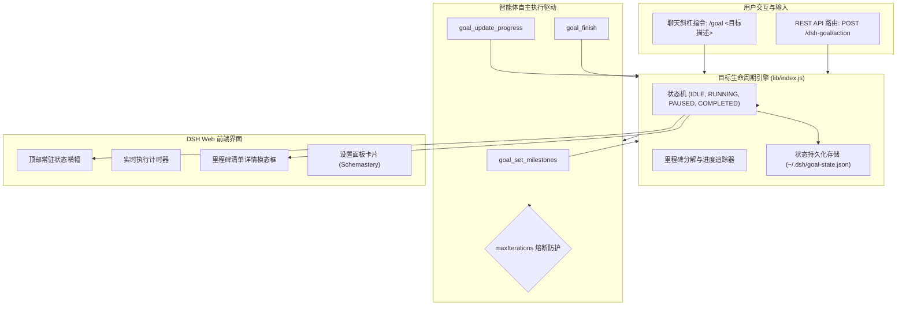

# 📦 @goodandready/dsh-goal

<div align="center">

<h3>面向 DeepSeek Harness 的自主目标执行、任务里程碑分解与顶部常驻状态条引擎</h3>

<p align="center">
  <a href="https://www.npmjs.com/package/@goodandready/dsh-goal"></a>
  <a href="../LICENSE"></a>
  <a href="https://github.com/topics/dsh-plugin"></a>
  <a href="https://nodejs.org"></a>
</p>

<!-- 作者所有项目展示页面链接 -->
<p align="center">
  <a href="https://goodandready.app/"></a>
</p>

<p align="center">
  <a href="../README.md"><b>🇬🇧 English</b></a> •
  <a href="README.ru.md"><b>🇷🇺 Русский</b></a> •
  <a href="README.zh.md"><b>🇨🇳 中文说明</b></a>
</p>

</div>

---

## ⚡ 概述与核心解决痛点

复杂的软件工程任务往往需要多步骤的自主循环：将宏观目标分解为里程碑子任务、多轮自动连续推进而无需用户反复手动下发指令，以及对执行过程保持清晰的可视化监控。

**`@goodandready/dsh-goal`** 通过 `/goal` 指令为 DeepSeek Harness 带来原生的目标自主执行系统：
* 🎯 **顶部常驻状态条**：固定在聊天窗口顶部的状态横幅，显示实时运行计时器（`• 2s`, `• 1m 45s`）、当前目标标题与控制按钮。
* ⏸️ **自主循环控制 (Play / Pause / Cancel)**：可随时暂停智能体自主多轮循环，或根据需要一键恢复。
* 📋 **里程碑任务抽屉**：交互式子任务清单，展示完成百分比进度条与执行日志。
* 🤖 **智能体原生工具**：提供 `goal_set_milestones`, `goal_update_progress`, `goal_finish` 工具。
* 🛡️ **安全防护机制**：支持配置 `maxIterations` 最大循环轮次，杜绝死循环消耗。

---

## 🏛️ 架构设计



---

## 📦 快速安装

```bash
dsh plugin --profile web add @goodandready/dsh-goal
```

重启 DeepSeek Harness 实例并刷新浏览器页面。

---

## 💬 快速上手

在聊天框中直接启动自主目标：

```text
/goal 重构身份验证中间件并编写端到端集成测试
```

或通过 REST 接口调用：

```bash
curl -X POST http://localhost:3080/dsh-goal/action \
  -H "Content-Type: application/json" \
  -d '{"action":"start","title":"优化数据库查询性能"}'
```

---

## ⚙️ 配置参数参考 (`settings.yaml`)

```yaml
dsh-goal:
  maxIterations: 25
  autoDrive: true
  enableSound: true
```

| 参数项 | 类型 | 默认值 | 说明 |
|:---|:---|:---|:---|
| `maxIterations` | `number` | `25` | 安全熔断阈值：单目标允许的最大自主轮次 |
| `autoDrive` | `boolean` | `true` | 是否在轮次结束后自动驱动智能体继续推进 |
| `enableSound` | `boolean` | `true` | 目标完成时是否播放提示音效 |

---

## 🧪 自动化测试

运行自动化测试套件：

```bash
npm test
```

---

## 📄 许可证

MIT © [GooDAnDReaDY](https://github.com/GooDAnDReaDY)
